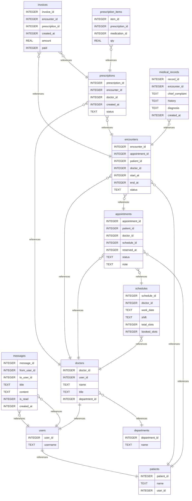

# 一、核心域与概念模型（ER 视角）

- **账号与权限**：User（账号）— Role（角色：patient/doctor/admin）
- **人员档案**：Patient（患者档案）、Doctor（医生档案）、Department（科室）
- **时间安排**：Schedule（出诊排班/号源）、Appointment（预约）
- **就诊与病历**：Encounter（就诊记录/挂号单）、MedicalRecord（病历/病程/小结）
- **处方与药品**：Prescription（处方头）、PrescriptionItem（处方明细）、Medication（药品）
- **收费与发药**：Invoice（收费票据）
- **消息通知**：Message（站内消息/提醒）
- **健康与评估记录**：HealthAssessment

> 「账号权限 + 人员 + 预约 + 就诊/病历 + 处方/药品 + 收费」六条主线

# 二、逻辑表清单（关键字段）

## 1) 账号与权限模块

- **users**
  - user_id 	用户主键	(PK, INTEGER)
  - username    登录名          (UNIQUE, TEXT)
  - password_hash (TEXT)  ← 只存 bcrypt/argon2 哈希（不要明文）
  - password_salt (TEXT, 可选)  ← 若哈希算法内含盐可不单列
  - role    角色（医生/患者/管理员）    (TEXT, CHECK role IN ('patient','doctor','admin'))
  - created_at    创建时间     (INTEGER, unix 时间戳)
  - status    启用标志（用来控制账号是否允许登录，可用于冻结）     (INTEGER, 0/1 启用禁用)
- **patients**
  - patient_id   患者ID     (PK, INTEGER)
  - user_id   账号ID       (FK→users.user_id, UNIQUE)  ← 一对一
  - name, gender, phone, id_number-身份证号  (都是TEXT)
  - address     (TEXT)
- **doctors**
  - doctor_id   医生ID (PK, INTEGER)
  - user_id   账号ID  (FK→users.user_id, UNIQUE)
  - name,gender,phone,address  （TEXT）
  - title   职称（如主任医师/主治医师）   (TEXT)
  - department_id  科室ID  (FK→departments.department_id)
  - intro   医生个人介绍  (TEXT)
- **departments**  科室
  - department_id (PK, INTEGER)
  - name  (TEXT, UNIQUE)

## 2) 排班与预约

- **schedules**（医生出诊计划/号源池）

  - schedule_id (PK)
  - doctor_id (FK)
  - work_date  出诊日期   (TEXT, 'YYYY-MM-DD')
  - shift  时段  (TEXT, CHECK IN ('AM','PM','EVENING'))
  - total_slots   预约号预源总数   (INTEGER)
  - booked_slots    已经预约数     (INTEGER, DEFAULT 0)
- **appointments** （预约记录）

  - appointment_id (PK)
  - patient_id (FK)
  - doctor_id (FK)
  - schedule_id (FK)
  - reserved_at  下单时间  (INTEGER)
  - status    状态（判断当前预约状态）   (TEXT, CHECK IN ('booked','checked_in','cancelled','no_show','finished'))

    **`booked`**

    - 已预约，但还没去医院报到。
    - 用户刚下单时的默认状态。

    **`checked_in`**

    - 患者到达医院，已经在分诊台/前台签到。
    - 通常表示医生端可以准备接诊。

    **`cancelled`**

    - 患者自己取消，或者医院因故取消。
    - 这时预约作废，但记录保留（方便统计）。

    **`no_show`**

    - 患者没有按时来就诊，也没有取消。
    - 医院会在排班结束后自动把未签到的预约标记为 `no_show`。

    **`finished`**

    - 就诊完成（医生看诊、开病历/处方）。
    - 表示预约生命周期正常结束。
  - note  备注（主诉/症状简述也可放这） (TEXT)

    业务规则（典型流转）

    - 新建预约：默认 `booked`。
    - 患者到院 → 改为 `checked_in`。
    - 患者取消 → 改为 `cancelled`。
    - 患者未到场且未取消，系统定时任务 → 改为 `no_show`。
    - 医生完成就诊 → 改为 `finished`。

  > 业务规则
  >
  > - `UNIQUE(doctor_id, work_date, shift)` 防重复排班。
  > - 余号 = `total_slots - booked_slots`（非持久化字段，接口现算或视图）。
  > - 创建预约时需检查：`booked_slots < total_slots`，并 `booked_slots += 1`。
  >

## 3) 就诊与病历

- **encounters**（一次就诊事件，挂号 → 看诊）

  - encounter_id (PK)
  - appointment_id (FK，可空：也允许现场挂号)
  - patient_id (FK)
  - doctor_id (FK)
  - start_at, end_at  开始时间，结束时间 (INTEGER)
  - status  就诊事件的当前状态  (TEXT, 'open'（进行中）,'closed'（已结束）,'cancelled'（已取消）)
- **medical_records**  （病历/病程）

  - record_id  (PK)
  - encounter_id  (FK)
  - chief_complaint  (TEXT)  主诉（患者**主动提出的主要症状** 或 **最想解决的问题**，通常用 **简短的一句话** 来概括）
  - history (TEXT)     现病史/既往史
  - diagnosis (TEXT)     诊断
  - created_at (INTEGER)  创建时间

  > 业务规则
  >
  > - 一个就诊可有 1..N 条病历（含补记/修改留痕）；简单起见也可限制 1:1。
  >

## 4) 药品与处方

- **medications** （药品主数据）

  - medication_id (PK)
  - name (TEXT, 索引/唯一视具体)  药名
  - spec (TEXT)         规格（如，"0.25*24片/盒"）
  - unit (TEXT)         开具单位（盒/瓶/支/片…）
  - price (REAL)        单价
  - stock_qty (REAL)    库存
- **prescriptions**   （处方头【谁开的、什么时候开的、当前状态】）

  - prescription_id (PK)
  - encounter_id (FK)   就诊ID
  - doctor_id (FK)
  - created_at (INTEGER)   创建时间
  - status (TEXT, CHECK IN ('draft','signed','dispensed','void'))

    每个状态代表处方在生命周期里的一个阶段：

    1. **`draft`（草稿）**
       - 医生正在开处方，还没签名确认。
       - 处方内容还可以修改。
    2. **`signed`（已签名/确认）**
       - 医生确认无误，处方正式生效。
       - 医生签名后，通常处方内容就不能随便修改。
    3. **`dispensed`（已发药）**
       - 药房根据处方发药，库存已扣减。
       - 患者已拿到药。
    4. **`void`（作废）**
       - 处方被撤销（例如医生开错药、患者取消就诊）。
       - 系统保留作废记录用于追溯。
- **prescription_items**    （处方明细）

  - item_id (PK)
  - prescription_id (FK)
  - medication_id (FK)  药品ID
  - dose (REAL)            单次剂量（患者每次服用/使用该药的量）
  - dose_unit (TEXT)     计量单位 （单次剂量的计量单位，如mg/ml/tab（片））
  - frequency (TEXT)       一天服药次数（例如 “bid（每日两次）/tid（每日三次）/ qid（每日四次））
  - days (INTEGER)    持续用药的天数
  - qty (REAL)             开具总量（总量qty = 单次剂量 dose * 频次 frequency * 天数 days）
  - usage (TEXT)           用法嘱托（口服/雾化/外用等）

## 5) 收费票据

- **invoices ** （收费票据单）
  - invoice_id (PK)
  - encounter_id (FK) / 或 prescription_id (FK)  二者选一，说明该张收费单是由什么产生的
  - created_at (INTEGER)  开票时间
  - amount (REAL)  总金额
  - paid (INTEGER, 0/1)   是否已支付，0未付款，1已付款

## 6) 消息通知

- **messages**
  - message_id (PK)
  - from_user_id (FK->users)  发件人
  - to_user_id (FK→users)      收件人
  - title (TEXT)    消息标题
  - content (TEXT)    消息正文
  - is_read (INTEGER, 0/1)   消息是否已读
  - created_at (INTEGER)     消息生成时间

## 7）健康评估记录

* HealthAssessment（健康评估记录）
  - **assess_id** (PK)
  - **patient_id** (FK→patients) 患者
  - **height_cm** (REAL) 身高（cm）
  - **weight_kg** (REAL) 体重（kg）
  - **heart_rate** (INTEGER) 心率（次/分）
  - **bp_systolic** (INTEGER) 收缩压（mmHg）
  - **bp_diastolic** (INTEGER) 舒张压（mmHg）
  - **lung_capacity** (REAL) 肺活量（mL）
  - **note** (TEXT) 备注（可空）
  - **created_at** (INTEGER) 记录时间（时间点）
  - **recorded_by** (FK→users，可空) 记录人（医生或本人）

# 三、关系与约束要点

- `User : Patient / Doctor = 1 : 0/1`

  **含义**：一个 `users` 账号，**至多**关联一个患者档案（`patients`）或一个医生档案（`doctors`）。

  - 允许三种情况：
    - 只有账号（既不是患者也不是医生，比如管理员）；
    - 账号↔患者（一对一）；
    - 账号↔医生（一对一）。
- `Department 1 : N Doctor`

  **含义**：一个科室有多个医生；一个医生属于**至多一个**科室（常见做法）。
- `Doctor 1:N Schedule;以及 Schedule 1:N Appointment（但同一号源总量受限）`

  **含义**：

  - 一个医生有多条排班（`schedules`）。
  - 一条排班（一个日/时段的号源）可被多个预约占用（`appointments`），但不得超过 `total_slots`。
- `Appointment → Encounter（1:1 或 1:0\1）`

  **含义**：

- 常规：一条预约，对应一次就诊（1:1）。
- 若允许**现场直接就诊（无预约）**，就变成 1:0\1（就诊可以没有对应预约）。

  **实现要点**：

- `encounters.appointment_id` `FK → appointments(appointment_id)` **可空**。
- 若你想强制 1:1，可在应用层限制“encounter 必须有 appointment_id 且唯一”。
- `Encounter 1:N MedicalRecord;Encounter 1:N Prescription;Prescription 1:N prescription_items`

  **含义**：

  - 一次就诊可生成多条病历记录（补记/阶段小结等）；
  - 一次就诊可开多张处方；
  - 一张处方包含多条明细（药品项目）。
- `Medication : PrescriptionItem = 1 : N`

  含义：

  * 一种药品（`Medication`）可以出现在多条处方明细（`PrescriptionItem`）里。
- `Encounter/Prescription → Invoice（1:0\N）`

  **含义**：

- 费用票据既可能以“就诊”为粒度开（挂号费、治疗费），也可能以“处方”为粒度开（药费），因此：

  - 一个 `encounter` 可关联多张 `invoice`；
  - 一个 `prescription` 也可关联多张 `invoice`（例如分次支付、补差额）。
- `User : Message = 1 : N （作为发送者或接收者）`

  一个用户（`User`）可以发送或接收多条消息（`Message`）。

- 消息可能是系统通知、医生和患者之间的沟通等。
- `Patient : HealthAssessment = 1 : N`

  一个患者（`Patient`）可以有多份健康评估表（`HealthAssessment`）。

- 例如定期健康随访表、体检问卷等。

